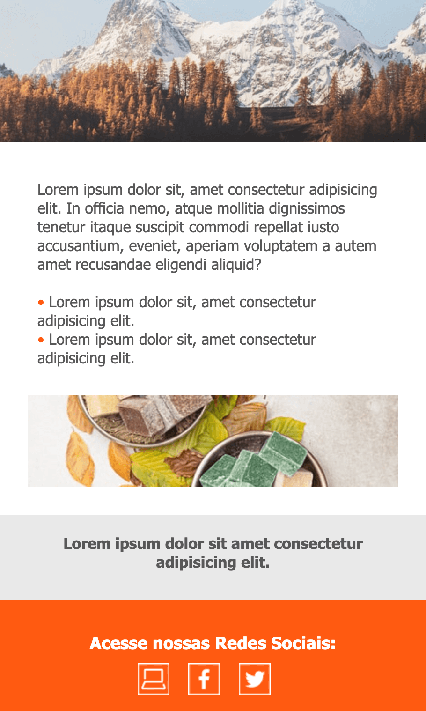

# Email marketing

O envio de email ainda é o meio mais usado para comunicação "Formal" entre empresas, entre empresas e cliente etc..

## HTML-4 & CSS-2 (Tableless)

A tecnologia é legada, para montar-mos o email marketing é usado de uma tecnica conhecida como tableless onde o desenvolvedor deve fazer recortes das imagens (utilizando photoshop por exemplo) e encaixa-las utilizando o table do html.

Features mais novas do html-5 e css-3 não são suportadas pelo protocolo de rede `smtp` que é o responsável por envio de email.

OBS: Pode usar div's mas para um layout mais complexo deve usar table.

---

## Exemplo

